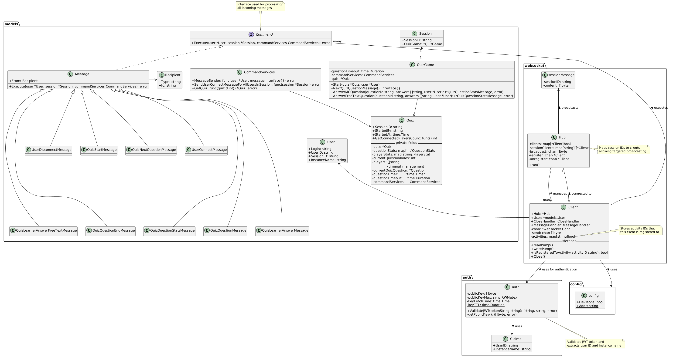

# LearnLoop


*[Logo credits](#7-logo-credits)*

- [1. LearnLoop Project Overview](#1-learnloop-project-overview)
  - [1.1. Core Features](#11-core-features)
  - [1.2. Architecture Overview](#12-architecture-overview)
  - [1.3. Usage](#13-usage)
- [2. Detailed Architecture](#2-detailed-architecture)
  - [2.1. Server](#21-server)
  - [2.2. Hub](#22-hub)
  - [2.3. Client](#23-client)
- [3. Frontend Architecture](#3-frontend-architecture)
- [4. Put everything together](#4-put-everything-together)
- [5. Messages](#5-messages)
  - [5.1. 4.1 Connect message](#51-41-connect-message)
  - [5.2. 4.2 Disconnect message](#52-42-disconnect-message)
- [6. Demo](#6-demo)
  - [6.1. 5.1 Generate fake JWT token](#61-51-generate-fake-jwt-token)
  - [6.2. 5.2 Update index.html](#62-52-update-indexhtml)
  - [6.3. 5.3 Run the server](#63-53-run-the-server)
  - [6.4. 5.4 Launch the browser](#64-54-launch-the-browser)
- [7. Logo credits](#7-logo-credits)

## 1. LearnLoop Project Overview

LearnLoop is a real-time interactive learning platform built with Go on the backend and a web-based frontend. The project facilitates communication between educators and learners through websocket connections, with a focus on interactive quiz activities.

### 1.1. Core Features

- **Real-time communication** through WebSockets
- **Interactive quizzes** with multiple question types (including free text answers)
- **User authentication** via JWT tokens
- **Session management** for different learning activities
- **Role-based functionality** (facilitators can launch quizzes for learners)

### 1.2. Architecture Overview

The system is built around three main components:

1. **Server** (index.go): Handles HTTP connections and WebSocket upgrades
2. **Hub** (hub.go): Manages client connections and broadcasts messages
3. **Client** (client.go): Handles individual WebSocket connections and message processing

The application uses Go's goroutines for concurrency:

- One goroutine for the Hub
- Two goroutines for each Client (read and write operations)

Communication between components happens through channels, making it efficient at handling multiple simultaneous connections.

### 1.3. Usage

The project includes a demo process for testing:

1. Initialize the project using `go mod tidy`
2. Generate a JWT token using the fake JWT server
3. Update the token in `index.html`
4. Run the server with `go run ./main -dev`
5. Open the HTML page in a browser to start interacting with the system

The architecture is designed to scale with multiple users participating in learning activities simultaneously.

## 2. Detailed Architecture



### 2.1. Server

The code for the `Server` type is in [index.go](main/index.go).

- The server application defines two types, `Client` and `Hub`.
- The server creates an instance of the `Client` type for each websocket connection.
- A `Client` acts as an intermediary between the websocket connection and a single instance of the `Hub` type.
- The `Hub` maintains a set of registered clients and broadcasts messages to the clients.

The application runs go routines:

- one goroutine for the `Hub`.
- two goroutines for each `Client`.

The goroutines communicate with each other using channels. The `Hub` has channels for registering clients, unregistering
clients and broadcasting messages. A `Client` has a buffered channel of outbound messages. One of the client's
goroutines reads messages from this channel and writes the messages to the websocket. The other client goroutine reads
messages from the websocket and sends them to the hub.

### 2.2. Hub

The code for the `Hub` type is in [hub.go](main/hub.go).

The application's `main` function starts the hub's `run` method as a [goroutine](https://gobyexample.com/goroutines).
Clients send requests to the hub using the `register`, `unregister` and `broadcast` channels.

The hub registers clients by adding the client pointer as a key in the `clients` map. The map value is always true.

The unregister code is a little more complicated. In addition to deleting the client pointer from the `clients` map, the
hub closes the clients's `send` channel to signal the client that no more messages will be sent to the client.

The hub handles messages by looping over the registered clients and sending the message to the client's `send` channel.
If the client's `send` buffer is full, then the hub assumes that the client is dead or stuck. In this case, the hub
unregisters the client and closes the websocket.

### 2.3. Client

The code for the `Client` type is in [client.go](main/client.go).

The `serveWs` function is registered by the application's `main` function as an HTTP handler. The handler upgrades the
HTTP connection to the WebSocket protocol, creates a client, registers the client with the hub and schedules the client
to be unregistered using a defer statement.

Next, the HTTP handler starts the client's `writePump` method as a goroutine. This method transfers messages from the
client's send channel to the websocket connection. The writer method exits when the channel is closed by the hub or
there's an error writing to the websocket connection.

Finally, the HTTP handler calls the client's `readPump` method. This method transfers inbound messages from the
websocket to the hub.

WebSocket connections
[support one concurrent reader and one concurrent writer](https://godoc.org/github.com/gorilla/websocket#hdr-Concurrency).
The application ensures that these concurrency requirements are met by executing all reads from the `readPump` goroutine
and all writes from the `writePump` goroutine.

To improve efficiency under high load, the `writePump` function coalesces pending chat messages in the `send` channel to
a single WebSocket message. This reduces the number of system calls and the amount of data sent over the network.

## 3. Frontend Architecture

The frontend code is in [index.html](index.html).

On document load, the script checks for websocket functionality in the browser. If websocket functionality is available,
then the script opens a connection to the server and registers a callback to handle messages from the server. The
callback appends the message to the chat log using the appendLog function.

To allow the user to manually scroll through the chat log without interruption from new messages, the `appendLog`
function checks the scroll position before adding new content. If the chat log is scrolled to the bottom, then the
function scrolls new content into view after adding the content. Otherwise, the scroll position is not changed.

The form handler writes the user input to the websocket and clears the input field.

## 4. Put everything together


## 5. Messages

### 5.1. 4.1 Connect message

on user connection, information of the user that has just connected are sent to all the users connected.

On user connection, several messages with all the currently user connected are sent to the user that has just connected

```json
{
  "type": 0, // MessageType.USER_CONNECTED constant
  "from": {
    "type": 1, // RecipientType.USER constant
    "id": "login"
  },
  "to": [
    {"type": "session", "id": 1}
  ]
}
```

### 5.2. 4.2 Disconnect message

Sent by the server upon websocket expected or unexpected closure.

```json
{
  "type": 3, // MessageType.USER_DISCONNECTED constant
  "from": {
    "type": 1, // RecipientType.USER constant
    "id": "login"
  },
  "to": [
    {"type": "session", "id": 1}
  ]
}
```

## 6. Demo

### 6.1. 5.1 Generate fake JWT token

Launch a container able to generate Jwt token

```bash
docker run -e ISSUER=did:web:localhost:8008 -p 8008:8008 ghcr.io/stackitcloud/fake-jwt-server:v0.1.1
```

Get the JWT token

```bash
curl -X POST http://localhost:8008/token
```

### 6.2. 5.2 Update index.html

Copy jwt token in index.html

### 6.3. 5.3 Run the server

```bash
go run ./main -dev
```

### 6.4. 5.4 Launch the browser

Launch the index.html

Send a message:

```json
{
  "type": 0,
  "from": {
    "type": 1,
    "id": "login"
  },
  "to": [
    {
      "type": 0,
      "id": "login"
    }
  ]
}
```

## 7. Logo credits

Logo generated using <https://stablediffusionweb.com/app/image-generator> prompt: "fun and simple logo without text for
an application providing facilitated realtime quiz chat and notifications, communication with learning loop feedback"
Negative prompt: "background, cat"
